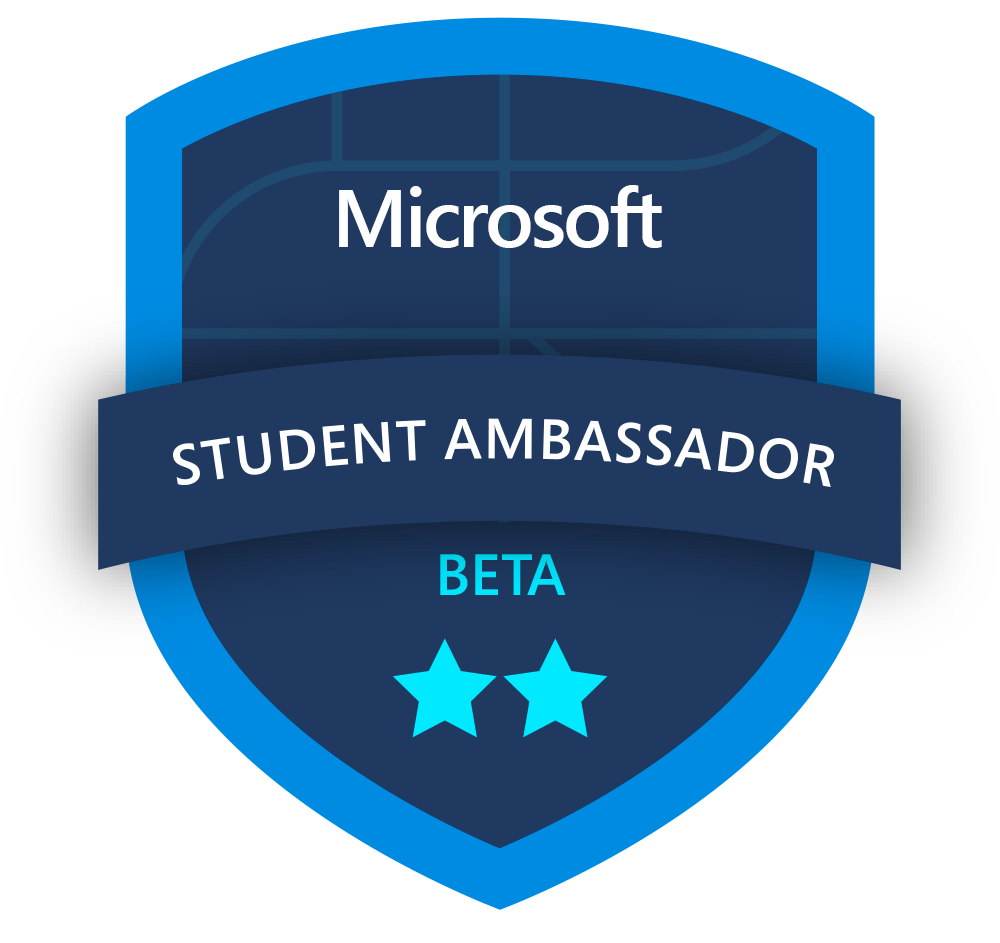

<div align="center">
  
  <h1>Technical Onboarding Process</h1>
</div>

### 👑 CCP & MVP(XDR & SIEM) + MLSA Communities @ Microsoft

```yaml
Name: Shahzal Rehman 샘  
Title: Beta MLSA | GitHub Certified | IBM Design Thinker  
Focus: Cloud, AI, Storytelling  
Currently: HSSC - ICS Physics @ Punjab College  
```

> 🚀 Rising Youth Influencer, Microsoft Learn Student Ambassador, GitHub Contributor, and Tech Event Organizer.

---

### 🏆 GitHub Trophies

[](https://github.com/Shahzal-Rehman)

---

### 🧰 Toolbox

<p align="left">
  
</p>

---

### 📊 GitHub Stats

<div align="center">


</div>

---
### 📣 Let's Discuss Biography!
His Excellency is standing out in a crowd of over ~1.53k students at his college. Balancing school life with his passions, Shahzal is already making waves both on stage and in the community.
His Education?
Currently studying HSSC-ICS-Physics (2023–2025) at Punjab Group of Colleges, and having completed SSC-Bio (2021–2023) at Fauji Foundation School, Shahzal brings focus and dedication to everything he does. Beyond academics, he’s well-known for his engaging presence, whether he’s leading events, telling stories, or inspiring his peers.
His Tech Achievements?
Though young, Shahzal has achieved remarkable recognition as the youngest 5x Microsoft CCP awardee of the year 2025 and holds the prestigious Defender XDR Black Belt from Microsoft — accomplishments that add a unique edge to his creative journey. As a MSFT SA (Beta) and GitHub Certified professional, along with various other credentials, he has made a significant impact on both the international and local levels.
His mission?
He’s passionate about challenging norms and using his voice — on screen and off — to inspire change and connect with people. Whether in front of the camera or engaging an audience, Shahzal believes in making every moment count and creating positive impact wherever he goes.
When he’s not acting or influencing, you’ll find him sharing stories, connecting with friends, or simply enjoying life as a vibrant young leader in his community.
✨ He is here for you; 
▶️ youtube.com/iamshahzal
 📸 instagram.com/iamshahzal
🔗linkedin.com/in/iamshahzal
ⓕ facebook.com/iamshahzal
ⓕ facebook.com/ShahzalTribe
ⓕ facebook.com/RehmanTribe2024
「✨Shahzal Rehman ke saath ✨」
 ✦-- GitHub | AWS | IBM | MLSA, CCP @ MSFT | Creds -----✦ credly.com/users/shahzal-rehman

---
### 📣 Let's Connect!

> 🔗 **Explore, Collaborate, Impact.**  
> 📡 Drop by or ping me on socials.  
> 💬 DMs always open for open-source collabs, tech talks, or design help!

---
